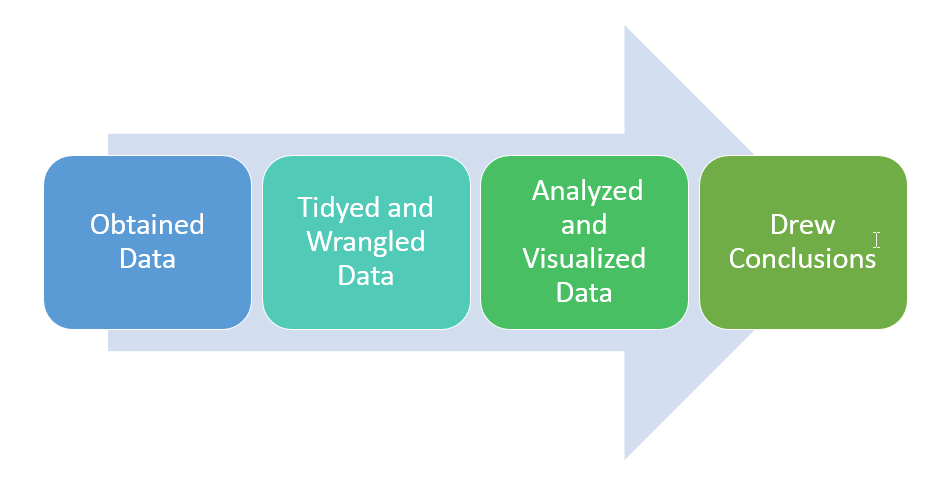

##Introduction

We were asked to use data to answer the question, "Which are the most valued data science skills?"

As a team we used `Github` and `Slack` as our method of team collaboration. Within Github, we *forked*, *edited* and *commited*. Then we utilized the *blame* view to review line-by-line revision history.


#Data

##Data Source

We obtained data from [Kaggle.com](https://www.kaggle.com/discdiver/the-most-in-demand-skills-for-data-scientists/) 

Jeff Hale obtained data from online job listing sites such as LinkedIn, Indeed, SimplyHired, Monster and AngelList in the US in October 2018 using Python. When observing this data he noted how many times a keyword was mentioned by post throughout the different platforms.

##Libraries
```{r message=FALSE, warning=FALSE}
library(tidyverse)
library(knitr)
library(kableExtra)
library(tm)
library(wordcloud)
library(memoise)
library(SnowballC)
library(RColorBrewer)
library(RCurl)
library(XML)
```

##Data Load

Read from CSV file which was uploaded to Github
```{r}
url <- "https://raw.githubusercontent.com/miachen410/DATA607Project3/master/DataSkills.csv"
data_skills <-read.csv(url, stringsAsFactors = FALSE)
kable(data_skills) %>% kable_styling(bootstrap_options = "striped", font_size = 7)
```

#Tidy and Wrangle

##Data Structure
First we looked at the structure of the dataset.
```{r}
str(data_skills)
```
##Data Types
We removed the commas in the numbers and changed the data types from character to numeric for the following columns: LinkedIn, Indeed, SimplyHired and Monster.
```{r}
data_skills$LinkedIn <- str_replace_all(data_skills$LinkedIn, ",", "") %>% as.numeric()
data_skills$Indeed <- str_replace_all(data_skills$Indeed, ",", "") %>% as.numeric()
data_skills$SimplyHired <- str_replace_all(data_skills$SimplyHired, ",", "") %>% as.numeric()
data_skills$Monster <- str_replace_all(data_skills$Monster, ",", "") %>% as.numeric()
str(data_skills)
```
##Data Subset
We got rid of the rows we didn't need by subsetting and eliminating those in which LinkedIn was NA; we also excluded the "Total" row which was not a data science skill.
```{r}
data_skills_subset <- subset(data_skills, !is.na(LinkedIn)) %>% subset(!Keyword == "Total")
kable(data_skills_subset) %>% kable_styling(bootstrap_options = "striped", font_size = 7)
```
##Data Mutate
We mutuated the data frame to generate two new columns `Total_Mention` and `% of Total`.
```{r}
data_skills_2 <- data_skills_subset %>% mutate(Total_Mention = LinkedIn + Indeed + SimplyHired + Monster) 
kable(data_skills_2) %>% kable_styling(bootstrap_options = "striped", font_size = 7)
```
##Data Mutate
We added rows "AI" and "Artificial Intelligence" then subtracted the overlapping skills. We assigned the values to "AI + Artificial Intelligence".
```{r}
data_skills_2[18,2:6] <- data_skills_2[16,2:6] + data_skills_2[17,2:6] - data_skills_2[18,2:6]
```

We added rows "NLP" and "Natural Language Processing" then subtracted the overlapping skills. We assigned the values to "NLP + Natural Language Processing".
```{r}
data_skills_2[21,2:6] <- data_skills_2[19,2:6] + data_skills_2[20,2:6] - data_skills_2[21,2:6]
```

We then removed the unnessary rows "AI", "Artificial Intelligence", "NLP" and "Natural Language Processing".


#Analysis and Visualization

##Word Cloud
```{r warning=FALSE}
res<-rquery.wordcloud(data_skills_2, type ="file", lang = "english",
                 min.freq = 1,  max.words = 200)]
```

##Conclusions

We observed the top five keyword/skills mentioned by post throughout the different platforms were *Machine Learning*, *Analysis*, *Statistics*, *Computer Science* and *Communication*. These keywords/skills ranked differently across platforms.

In LinkedIn, the rank was as follows: *Machine Learning*, *Analysis*, *Statistics*, *Computer Science* and *Communication*.
In Indeed and Simply Hired, the rank was as follows: *Analysis*, *Machine Learning*, *Statistics*, *Computer Science* and *Communication*.
In Monster, the rank was as follows: *Analysis*, *Statistics*, *Machine Learning*, *Communication* and *Computer Science*.


